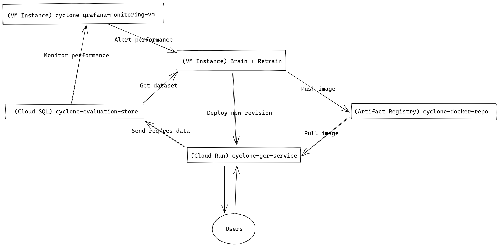

# Cyclone

> Performance monitoring for autonomous ML model retraining

TODO(Andrea): a paragraph explaining what it does and the problems it solves

## Architecture

### Scaling serving using Google Cloud Run (GCR)

## Extensions and future work 

## Lessons learned
