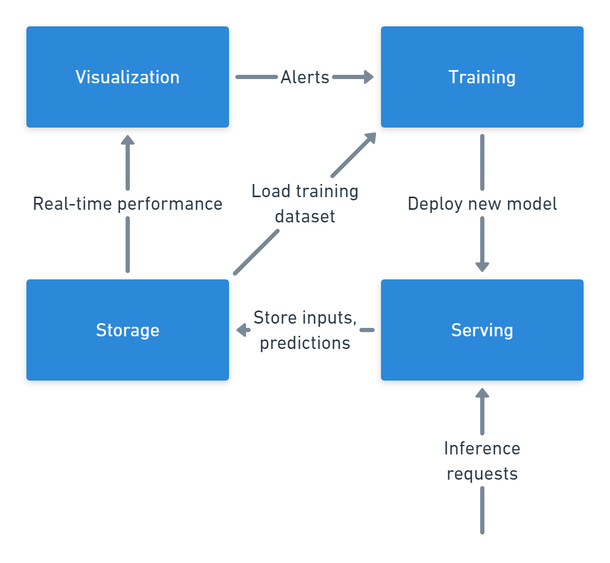

# Cyclone: performance monitoring for autonomous ML model retraining

Machine Learning is taking our world by storm.
However, unlike traditional software, maintaining adequate ML model performance is a hard problem praticioners face.
This is due to ML-only issues such as concept and data drift.

Currently, most production ML models are retrained on a periodic basis.
This is not great for several reasons.
First, the data could change faster than the model is retrained.
Second, if the performance is sufficient, retraining is pointless and wastes expensive computational resources.

Cyclone is a software system that performs serving, monitoring, and automatic retraining of ML models.
This is a proof-of-concept implementation of it, created as the final project for Aalto University's CS-E4660: Advanced Topics in Software Systems. 

---

[[_TOC_]]

## Requirements

- Serve one or more machine learning models as user-accessible REST APIs
    - Scale to zero or multiple machines, depending on the usage
    - Deploy any kind of Docker container
    - Zero downtime model updates

- Store all data sent to/from the models
    - Store, in a flexible format, all input features sent to the model
    - Efficiently serve all of input data and associated labels for retraining
    - Join every input requests with its prediction and its true labels
    - Monitor input data distribution shift in real time
    - Monitor predictive performance in real time, using predictions and true labels

- Visualize metrics in real-time in a dashboard 

- Automatically retrain and redeploy models when the performance dips below a threshold

## Architecture

### High level components view

To satisfy the requirements four main components are required:



The **serving component** handles serving of the ML models.
It receives a trained model from the training component, as a Docker image.
It performs autoscaling and traffic splitting in order to ensure zero downtimes.
Each deployed model will write its inputs and outputs to the storage component

The **storage component** handles storing of all input/output pairs from the served models.
Additionally it merges the inputs and predictions with their respective ground truths, once they become available.
Finally, it provides data for the visualizaion and training components.

The **visualization (and monitoring) component** will periodically compute the performance metrics of interest.
If these metrics drop below a certain threshold, it sends an alert to the training component.

The **training component**, once it receives an alert from the visualization and monitoring component, will retrain a model.
To do so, it loads a recent subset of labelled data from the storage layer, and use it to train a new model.
The trained model will be packaged in a Docker image, which is sent to the serving component.

### Implementation


The **serving component** uses Google Cloud Run (GCR) to serve Docker images.
GCR is an hosted platform based on Kubernetes and Knative.
It supports out of the box all of the features we need (traffic splitting, scaling to zero, scaling horizontally).
Additionally, it also handles load balancing and HTTPS certificate renewal.
We deploy a service on GCR called `cyclone-gcr-service`.
This service serves the ML model images to users, exposing them via an HTTPS endpoint.

The **storage component** uses Google Cloud SQL to store and serve data.
It is an hosted database product, based on PostgreSQL.
The database uses a table called `prediction` to store our data.
The table's schema is:
```sql
CREATE TABLE prediction (
    id INTEGER PRIMARY KEY,
    input JSONB NOT NULL,
    prediction JSONB NOT NULL,
    model_id TEXT NOT NULL,
    label JSONB,
    created_at TIMESTAMPTZ NOT NULL
)
```

The **visualization (and monitoring) component** uses Grafana hosted on a Google Compute Engine VM Instance to build interactive dashboards.
Additionally, it uses Grafana alerts and webhook notification channels to notify the training components to retraing a model.
The dashboard looks like this:


The **training component** is a custom Python server, hosted on a Google Compute Engine VM Instance.
Under the hood, it uses mlflow to train, evaluate, and package ML models into Docker containers.
When a model has been trained, it will be pushed to the **image registry component**, which uses Google Cloud's Artifact Registry.
Finally, GCR's Admin API is used to deploy a new revision of the `cyclone-gcr-service`, pulling the latest Docker image from the registry.

## Project structure

```bash
.
├── 01-bike-sharing-demand-drift.ipynb # notebook to show a model's performance drop over time and the positive impact of retraining 
├── 02-test-model-serving.ipynb # notebook to test mlflow's local model serving
├── 03-test-docker-model-serving.ipynb # notebook to test mlflow's dockerized model serving
├── 04-test-docker-training-serving.ipynb # notebook to test mlflow's dockerized model training and serving
├── 05-gcloud.ipynb # notebook to test deploying a model serving image on Google Cloud
├── 06-demo-steps.ipynb # notebooks to run the demo
├── README.md
├── bike-rental-regression # mlflow project to train a model and produce a scikit-learn model artifact
├── brain # Flask app that listens for grafana webhook calls and retrains and redeploys new models on GCR
├── data
├── docs
└── serving-image # Custom Docker image and custom serving app. Replaces mlflow's default serving image
```

## How to run the demo

These steps allow a user to recreate the project and run the demo.
It assumes that the project will be deployed on Google Cloud Platform (GCP).

1. Create an Artifact Registry Docker repository called `cyclone-docker-repo`.
[GCP Docs](https://cloud.google.com/artifact-registry/docs/docker/quickstart)
1. Create a Google Cloud Run service called `cyclone-gcr-service` and deploy an
image from the Docker repo. [GCP Docs](https://cloud.google.com/run/docs/deploying)
1. Create a PostgreSQL database instance called `cyclone-evaluation-store` on
Cloud SQL. [GCP Docs](https://cloud.google.com/sql/docs/postgres/quickstart)
1. Create the `prediction` table using the aforementioned schema.
1. Connect Cloud Run to Cloud SQL.
[GCP Docs](https://cloud.google.com/sql/docs/postgres/connect-run)
1. Create a VM instance called `cyclone-grafana-monitoring-vm`, using
Cloud SQL Auth Proxy connect it to Cloud SQL, start Grafana.
1. Create a grafana dashboard to monitor the `prediction` table.
1. Create a VM instance called `cyclone-brain-vm`, using Cloud SQL Auth Proxy
connect it to Cloud SQL, clone and run `brain`.
1. Locally train a model (using `mlflow run`) on January data and push an image to
Artifact Registry.
1. Using the image, deploy a new revision of the GCR service
1. Locally open `06-demo-steps.ipynb` and run the cells sequentially,
monitoring Grafana in the meantime.

## Improvements and future work

### Reactive architecture

Currently, most of the system's component are very tightly coupled with each other.
The serving component, in order to serve predictions, needs the storage component to be available.
The visualization and monitoring component will fail to send alerts if the training component is not responsive.
This is clearly bad from a reliability and elasticity perspective.

To address this issue we believe that adopting principles from [reactive architectures](https://www.reactivemanifesto.org/) is beneficial.
More specifically, using message queues such as RabbitMQ or Apache Kafka could help decouple the systems.

### Split inference and training databases

The inference database (also called evaluation store) and the training data database, in this architecture, live in the same PostgreSQL instance.
These two databases have very different access patterns, respectively, write-heavy and read-heavy.
In order to achieve the best performance, splitting these two stores in two separate and potentially different databases, could be beneficial.

Another interesting option would be to use a [feature store](https://www.featurestore.org/).

### Use a workflow management platform for training and deployment

Currently the training service (i.e.`cyclone-brain-vm`) runs a custom python web server.
This server listens for grafana webhook alerts and re-runs the training and deployment steps.
A more solid solution would involve using a product such as Apache Airflow, in order to run command DAGs.
This will also help us scale to multiple models, as well as multiple workers.

### Other

Many other improvements could be made, here we name a few without delving into details

- Reduce loop latency by speeding upDdocker container building or by restricing model families and only updating parameters

- Model, data, inference lineage and observability. Using tools such as [mltrace](https://github.com/loglabs/mltrace) and [DVC](https://dvc.org/).

- Distributed training, distributed image building (Cloud build)

- Declarative deployment (Terraform/Docker swarm/Kubernetes, Infrastracture as Code)

## Lessons learned

Serverless architectures, such as the one provided by Google Cloud Run (GCR), can greatly simplify ML model serving.
This is because of three main features: horizontal scaling to zero/infinity, zero-downtime deployments, and container-based deployments.
It is not a coincidence that both GCR and KServe, Kubeflow Serving's new name, a popular MLOps platform, share the same underlying tech stack.


Designing and building a complex, multiservice cloud architecture is no easy feat.
One of the biggest pain points was the slow feedback loop between making a local change and have it deployed in the cloud.
To address this issue I tried replicating the cloud environment locally, in order to reduce the feedback latency.
While this solved the latency issue, it also allowed for slight differences between the development and production environment, which were quite painful to debug.

## References

- [Aalto University's Advanced Topics in Software Systems (CS-E4660)](https://version.aalto.fi/gitlab/sys4bigml/cs-e4660)

- [Josh Tobin's "The Missing Link in ML Infrastructure"](https://www.youtube.com/watch?v=qERW9R3espg)

- [Chip Huyen's blog](https://huyenchip.com/)

- [Shreya Shankar's blog](https://www.shreya-shankar.com/)

